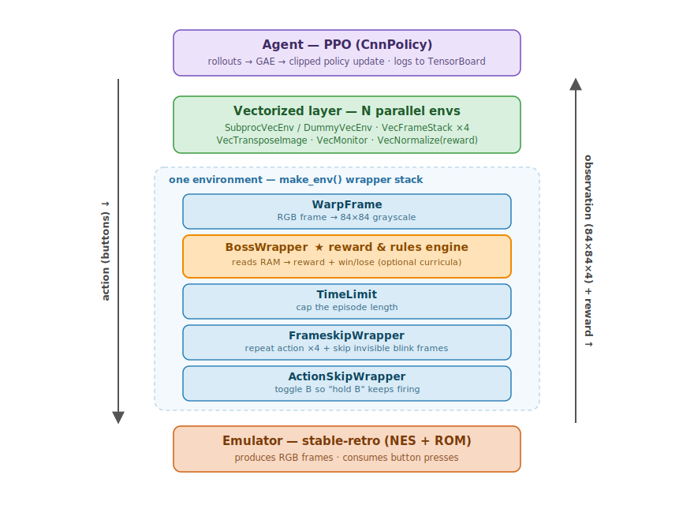

# Architecture Guide

*Read this in another language: **English** · [Português](ARCHITECTURE.pt-BR.md)*

This document explains how the project is built, what every class does, and how the pieces fit
together. It is written for someone who has **never seen the codebase** and is not assumed to be
an expert in reinforcement learning (RL). Read it top to bottom and you should be able to find your
way around the code with confidence.

> TL;DR — A neural network learns to play *Mega Man* (NES) boss fights by looking at the screen
> (just the pixels) and pressing buttons. The game runs inside an emulator; a stack of small
> "wrapper" classes turns raw game frames into the network's input and turns game-memory readings
> into a numeric reward. The PPO algorithm uses that reward to gradually improve the network.

---

## 1. What problem are we solving?

We want an agent (a policy network) that **defeats a boss** in *Mega Man 1* using only what a human
would see — the pixels on the screen. The agent has no privileged access to the game's internal
state in its *observation*: it must infer everything (enemy position, its own health, projectile
timing) from the image.

This is framed as a **reinforcement learning** problem:

- At each step the agent receives an **observation** (the screen).
- It picks an **action** (a combination of buttons).
- The environment returns a **reward** (a small number telling the agent how well it is doing) and
  the next observation.
- The agent's goal is to maximize the total reward over an episode (one boss fight).

We use **PPO** (Proximal Policy Optimization), a popular and stable RL algorithm, from the
[stable-baselines3](https://stable-baselines3.readthedocs.io/) library. The NES game is emulated by
[stable-retro](https://github.com/Farama-Foundation/stable-retro).

### Mini-glossary (just enough to read on)

| Term | Meaning in this project |
|------|--------------------------|
| **Episode** | One boss fight, from reset until the boss dies, the player dies, or a time limit. |
| **Policy** | The neural network that maps an observation to an action. |
| **Observation** | An 84×84 grayscale image, stacked over the last 4 frames (`84×84×4`). |
| **Action** | A `MultiDiscrete` choice: a movement direction + jump (A) + shoot (B). |
| **Reward** | `r = d·(hits − m·damage)`; small positive for hitting the boss, negative for taking damage. |
| **Frameskip** | The agent acts once every N emulator frames (here N=4), to act on a human-like timescale. |
| **Frame stacking** | Feeding the last 4 frames so the network can perceive motion/velocity. |
| **PPO** | The training algorithm that updates the policy from collected experience. |
| **GAE** | Generalized Advantage Estimation — how PPO estimates "how much better than average" an action was. |
| **PBRS** | Potential-Based Reward Shaping — an extra, *safe* reward signal used only for the Yellow Devil. |
| **Boss HP** | The boss's health, read from emulator RAM. Reaching 0 = a win. |

---

## 2. The big picture

Data flows in a closed loop. The emulator produces a frame; a stack of wrappers transforms it into
the agent's observation and turns game-memory readings into a reward; the agent (PPO) chooses an
action; the wrappers translate it back into button presses; the emulator advances one step.
Periodically, PPO takes the collected `(observation, action, reward)` data and improves the policy.



**How to read the diagram:** the right-hand arrow is the **observation + reward** travelling
bottom-to-top; the left-hand arrow is the **action** travelling top-to-bottom. Start at the bottom:
the **emulator** emits a raw RGB frame, which flows up through the per-environment wrapper stack
(`make_env`) — each wrapper adds one transformation — then through the **vectorized layer** that runs
N copies in parallel and stacks the last 4 frames, and finally reaches the **PPO agent**. The
agent's chosen action travels back down the same path, where `ActionSkipWrapper` converts it into the
correct NES button cadence just before it reaches the emulator. The highlighted orange box,
`BossWrapper`, is where the reward and the win/lose conditions are computed.

Two scripts drive everything:

- **`src/train.py`** — builds the environment, creates the PPO model, runs the training loop, saves
  checkpoints and the best model.
- **`src/eval_win.py`** — loads a saved model and measures whether it beats the boss.

Both rely on **`src/env.py`** (to build environments) and **`src/wrappers.py`** (the transformation
classes). The game itself comes from **`custom_integrations/`** plus a user-supplied ROM.

---

## 3. Repository layout

```
src/
  wrappers.py   # the transformation classes (the heart of the env)
  env.py        # factory functions that assemble and vectorize environments
  train.py      # training entry point (PPO + callbacks + the fixed "recipe")
  eval_win.py   # evaluation entry point (load a model, count wins)
  __init__.py   # makes `src` an importable package
custom_integrations/MegaMan-v1-Nes/   # the stable-retro game definition (no ROM)
docs/ARCHITECTURE.md                  # this file
environment.yml / requirements.txt    # dependencies
README.md / README.pt-BR.md           # usage guide (English / Portuguese)
```

Generated at runtime (not committed): `logs/`, `checkpoints/`, `models/`.

**Where to start reading:** `src/wrappers.py` (understand the env), then `src/env.py` (how it is
assembled), then `src/train.py` (how it is trained), then `src/eval_win.py`.

---

## 4. The environment, wrapper by wrapper

A "wrapper" is a class that wraps another environment, intercepting `reset()` and `step()` to add
behavior. They form an onion: each one calls the one inside it. The order matters. From innermost
(closest to the emulator) to outermost (closest to the agent), as assembled in `make_env`:

```
stable_retro.make(...)        # raw NES env: RGB image in, button presses out
  └─ ActionSkipWrapper        # fixes the shoot-button cadence
       └─ FrameskipWrapper     # acts every 4 frames; also skips "blink" frames
            └─ TimeLimit        # ends the episode after a fixed number of frames
                 └─ BossWrapper  # computes the reward and win/lose conditions
                      └─ WarpFrame  # converts the image to 84×84 grayscale (outermost)
```

### 4.1 `ActionSkipWrapper`

**Problem it solves:** On the NES, Mega Man fires only when you *press* B — holding B does nothing
after the first shot. A naive policy that learns to "hold B" would fire once and then stop.

**What it does:** It keeps a one-bit toggle (`b_state`). When the agent requests "shoot"
(`action[0] == 1`), it lets the press through on one step and forces a release on the next, so a
policy that simply holds B still fires a continuous stream of shots. The jump button (A) is **not**
toggled, because chopping a jump would prevent Mega Man from reaching the Yellow Devil's eye.

> Action layout used throughout the code: `action[0]` = B (shoot), `action[1]` = D-pad
> (none/left/right/up/down), `action[2]` = A (jump). It is a `MultiDiscrete([2, 5, 2])` space.

### 4.2 `FrameskipWrapper`

**Problem it solves:** The NES runs at ~60 frames/second. Deciding 60 times per second is wasteful
and makes credit assignment hard. Also, right after taking damage Mega Man "blinks" (flickers
invisible), so those frames carry little useful visual information.

**What it does:**
- Repeats the chosen action for `skip` (=4) emulator frames, summing their rewards.
- Then keeps stepping *while Mega Man is in an invisible blink frame*, inferred from the
  `blink_counter` RAM value (invisible when `blink_counter % 4 ∈ {1, 2}`), up to a safety cap of 60
  extra frames. This way the agent's next observation is a *visible* frame.
- `frame_sink`: an optional hook. If set to a list, every raw emulator frame (RGB + audio) is
  appended to it — used by external recording tools to capture true gameplay. Unused in training.

### 4.3 `TimeLimit` (from Gymnasium)

A standard wrapper that truncates the episode after `max_episode_steps`. We compute it as
`max_episode_frames // frameskip`, so that changing the frameskip keeps roughly the same *in-game
time* per episode (e.g. 7200 frames = 1800 agent-steps at skip 4).

### 4.4 `BossWrapper` — the reward and rules engine

This is the most important wrapper. It reads the game's RAM each step and turns it into the reward
and the episode-ending conditions. It never changes the *image* the agent sees; it only changes the
*reward* and *done* signals (and exposes useful values in the `info` dictionary).

**Reward function** (computed in `step`):

```
reward = 0
reward += d                       if the boss lost HP this step          (a hit landed)
reward -= d * damage_penalty_mult if the player lost HP this step        (took damage)
reward += win_bonus               on the step the boss reaches 0 HP      (terminal)
# optional/dense terms (off in the standard recipe):
reward += aim_bonus  / -= waste_penalty   when shooting with the eye open / closed
reward += survival_bonus                  per step while alive
reward += gamma*phi(s') - phi(s)          PBRS aiming term (Yellow Devil only, see below)
```

with `d = 0.05`. During **training** `damage_penalty_mult = 2.0` and `win_bonus = 0.5`; during
**evaluation** they revert to `1.0` and `0.0` (the real task). That is why a *flawless* evaluation
(killing the boss without taking damage) scores exactly `n_hits · d`.

**Termination conditions** (the episode ends when):
- player health reaches 0, or the lives counter drops (death);
- Mega Man touches spikes (`touching_obj_top == 3` or `touching_obj_side == 3`);
- the boss's health reaches 0 (**win**);
- ammo runs out while the boss is still alive (only relevant for ammo-limited weapons).

**RAM values it reads** (via the integration's named variables, with safe fallbacks): `health`,
`lives`, `boss_health`, `weapon_energy`, `eye_state`, `x`, `y`, `screen`, plus the Yellow Devil's
eye Y-coordinate (RAM address `1537`) read directly for the aiming term.

**Potential-Based Reward Shaping (PBRS), `align_bonus`** — used only for the Yellow Devil. The boss
is only vulnerable for ~1 frame when its eye opens, and a random shot essentially never lands, so
the agent never gets a first reward to learn from (the "bootstrap wall"). PBRS adds a dense
"get your shot to the eye's height" gradient:

```
phi(s)   = align_bonus · exp(-(err/18)²),  err = | shot height − eye height | (in pixels)
shaping  = gamma · phi(s') − phi(s)
```

The key property (Ng et al., 1999) is that this form of shaping is **policy-invariant**: it guides
exploration without changing which policy is optimal, so the agent cannot "farm" it by hovering near
the eye without killing the boss. `phi` is forced to 0 once the boss dies (correct terminal value).

**Optional curriculum knobs** (present in the class, all *off* in the standard recipe, kept for
experimentation): `unlimited_ammo`, `invincible`, `bonus_hp`, `survival_bonus`, `waste_penalty`,
`aim_bonus`, `ammo_budget`, `fire_from_action`, `post_kill_frames`. They were used while developing
the recipe (e.g. to pre-train aiming with infinite ammo) and are documented inline in the code.

**Helper:** `_info_dict(...)` builds the per-step `info` dictionary (`hp`, `boss_hp`, `lives`, `x`,
`y`, `screen`, `weapon_energy`, `eye_state`) in one place, used identically by `reset` and `step`.

> Subtle but important detail handled in `reset`: stable-retro's `info` is often **empty** right
> after a reset. Trusting a wrong default (e.g. `lives = 9` when the save has 8) would make the very
> first step look like "a life was lost" and end the episode after one step. So `reset` reads the
> **real** values straight from RAM via `lookup_value`.

### 4.5 `WarpFrame`

Converts each RGB frame to grayscale and resizes it to 84×84 (`cv2.cvtColor` + `cv2.resize` with
`INTER_AREA`). This is the standard Atari-style preprocessing: color is unnecessary, and a smaller
image is much cheaper for the CNN. Output shape: `(84, 84, 1)`. This is the **outermost** wrapper,
so its output is exactly what the vectorized layer (next section) stacks and feeds to the policy.

---

## 5. Assembling and vectorizing environments — `src/env.py`

`env.py` contains the factory functions that build the wrapper stack above and then run many copies
of it in parallel.

- **`_register_custom_integrations()`** — tells stable-retro where to find our custom game
  (`custom_integrations/`). It runs once per process (a guard flag prevents repeated registration).
  This matters because parallel workers are separate processes that each re-import the module.

- **`make_env(...)`** — builds **one** environment: calls `stable_retro.make(...)` with
  `inttype=CUSTOM_ONLY` (use only our integration), `MULTI_DISCRETE` actions and `IMAGE`
  observations, then wraps it in the onion from Section 4. Returns a single Gym environment. All the
  reward/curriculum parameters are passed straight through to `BossWrapper`.

- **`make_venv(...)`** — builds **N** environments and stacks the vectorized layer on top:
  1. `SubprocVecEnv` (parallel processes) if `n_envs > 1`, else `DummyVecEnv` (in-process).
  2. `VecFrameStack(n_stack=4)` — stacks the last 4 grayscale frames → the agent's real input
     becomes `84×84×4`. This is what lets a feed-forward CNN perceive motion.
  3. `VecTransposeImage` — reorders axes to PyTorch's `(channels, height, width)`.
  4. `VecMonitor(info_keywords=("hp", "boss_hp"))` — records episode statistics.
  5. `VecNormalize(norm_obs=False, norm_reward=True)` — optional running normalization of the
     **reward only** (never the image), which sharpens the learning signal and is safe for evaluation.

  To avoid duplicating the long parameter list, the per-env settings are collected once into an
  `env_kwargs` dict and forwarded to each worker; only `render_mode`/`record` vary per worker rank.

The result of `make_venv` is the single object that PPO interacts with: calling `.step(actions)` on
it advances all N environments at once and returns batched observations, rewards and `done` flags.

---

## 6. Training — `src/train.py`

### 6.1 The "recipe" (module-level constants)

Because the hyperparameters and the reward are **the same for every boss**, they are hard-coded as
constants at the top of the file instead of being command-line flags. This is what makes the recipe
reproducible: there is nothing to mistype.

- Reward/curriculum: `D = 0.05`, `DAMAGE_PENALTY_MULT = 2.0`, `WIN_BONUS = 0.5`, `FRAMESKIP = 4`,
  `NORM_REWARD = True`.
- PPO: `LR = 2.5e-4` (linear decay), `ENT_COEF = 5e-3`, `TARGET_KL = 0.05`, `GAMMA = 0.99`,
  `GAE_LAMBDA = 0.95`, `CLIP_RANGE = 0.2`, `VF_COEF = 1.0`, `MAX_GRAD_NORM = 0.5`, `N_STEPS = 1024`,
  `BATCH_SIZE = 128`, `N_EPOCHS = 4`, `SEED = 666`.

Only the few things that genuinely differ per boss are command-line flags: `--tag`, `--state`,
`--n-hits`, and (for the Yellow Devil) `--align-bonus` and `--episode-frames`.

### 6.2 `linear_schedule(initial_value)`

Returns a function that PPO calls with `progress_remaining` going from 1.0 (start) to 0.0 (end),
producing a learning rate that decays linearly to 0. A decaying LR helps the policy fine-tune after
it has roughly stabilized.

### 6.3 Evaluation callback (`EvalCallback`)

Every `eval_freq` steps SB3's stock `EvalCallback` runs the current policy on a **separate
evaluation environment** (the *real* task — no reward shaping, `damage_penalty_mult = 1.0`, no win
bonus) and:
- logs `eval/mean_reward` and `eval/mean_ep_length` to TensorBoard;
- saves `best_model.zip` whenever the mean reward improves;
- forwards control to a `StopTrainingOnRewardThreshold` callback (see early-stop below).

The stock callback already does all of this, so no custom subclass is needed.

### 6.4 `main()` — the training procedure

1. Parse the per-boss flags.
2. Compute the **early-stop threshold**: `reward_threshold = (n_hits − 0.5)·d`. A flawless kill
   scores `n_hits·d`; the threshold sits just below it, so training stops only when the agent wins
   *without taking damage*.
3. Build two environments with `make_venv`:
   - **training env** — with shaping (2× damage penalty, win bonus, and the YD aiming bonus);
   - **evaluation env** — the real task (no shaping), single environment, used by the callback.
4. Create the callbacks:
   - `CheckpointCallback` — saves a checkpoint every ~500k steps;
   - `StopTrainingOnRewardThreshold` — the early-stop trigger;
   - `EvalCallback` — runs eval every ~100k steps, saves the best model.
5. Create the PPO model with `CnnPolicy` and the recipe constants, or resume from a checkpoint if
   `--checkpoint` is given.
6. Call `model.learn(...)`. PPO repeatedly: collects a rollout of experience from the N parallel
   envs, computes advantages with **GAE**, and updates the network with the clipped PPO objective.
7. When training ends (early-stop or the timestep ceiling), save `final_model.zip` in addition to
   the `best_model.zip` produced by the eval callback.

**Outputs** (namespaced by `--tag`): `logs/<tag>/` (TensorBoard), `checkpoints/<tag>/` (periodic
snapshots), `models/<tag>_best/best_model.zip` and `.../final_model.zip`.

---

## 7. Evaluation — `src/eval_win.py`

This script answers a simple question: *does this saved model actually beat the boss?*

- **`run_episode(model, env, deterministic)`** — plays one full episode and returns a dict with the
  total reward, number of steps, the **lowest boss HP seen** (`min_boss`; 0 means the boss died),
  the final player HP, and a `win` flag (`min_boss <= 0`). A 5000-step safety cap prevents hangs.
- **`main()`** — loads the PPO model, builds a single **real-task** environment (no shaping, with
  `D`/`FRAMESKIP` matching training), runs `--episodes` episodes (stochastic by default, or
  `--deterministic` for the greedy policy), and prints per-episode results plus a summary: **win
  rate, mean reward ± std, and mean episode length**.

Because evaluation uses the unshaped task, the reward it reports is directly comparable to the
flawless ceiling `n_hits·d`.

---

## 8. The game definition — `custom_integrations/MegaMan-v1-Nes/`

stable-retro does not know about *Mega Man* out of the box; we provide a **custom integration**: a
folder describing how to read and drive the game. It contains:

- **`rom.nes`** — the actual game (a NES ROM). **Not included** for legal reasons; you supply your
  own. stable-retro verifies it against...
- **`rom.sha`** — the expected SHA-1 of the ROM (`2f88381…`).
- **`data.json`** — declares the **RAM variables** the project reads (their memory addresses and
  types): e.g. `health`, `lives`, `boss_health`, `weapon_energy`, `eye_state`, `x`, `y`, `screen`,
  `blink_counter`, `touching_obj_*`. These names are exactly what `BossWrapper` looks up.
- **`scenario.json`** — declares the action set (the button groups that form the `MultiDiscrete`
  space). The actual reward/done logic lives in `BossWrapper`, not here.
- **`metadata.json`** — integration metadata (e.g. the default starting state).
- **`*.state`** — **save states**: emulator snapshots that drop the agent directly into a specific
  boss fight (`Bombman-boss.state`, `YellowDevil-boss.state`, …). These are the per-boss starting
  points selected with `--state`.

When `make_env` calls `stable_retro.make(..., inttype=CUSTOM_ONLY, state=<name>)`, stable-retro
loads the ROM, applies the named save state, and exposes the RAM variables from `data.json` in the
`info` dictionary on every step.

---

## 9. End-to-end lifecycle

```
   you provide rom.nes
          │
          ▼
  python src/train.py --tag bombman --state Bombman-boss --n-hits 14
          │   builds train env (shaped) + eval env (real)
          │   PPO collects rollouts → GAE → policy update  (repeat)
          │   eval every ~100k steps → saves best_model when it improves
          │   early-stop when eval reward ≥ (n_hits-0.5)·d  (a flawless win)
          ▼
  models/bombman_best/best_model.zip
          │
          ▼
  python src/eval_win.py --model models/bombman_best/best_model.zip --state Bombman-boss
          │   runs N real-task episodes
          ▼
  "Wins: 10/10 (100%)  Mean reward: 0.7000  Mean length: 146 agent-steps"
```

Per-boss, the only differences are the `--state`, the `--n-hits` (which sets the early-stop
threshold), and — for the Yellow Devil only — the `--align-bonus 0.10` and a longer
`--episode-frames 14400`. Everything else is the shared recipe.

---

## 10. Design choices worth knowing

- **Pixels only.** All game-state knowledge (HP, boss HP, eye state, positions) is used *only* to
  build the reward and the done signal — never added to the observation. The policy must learn to
  read the screen.
- **No LSTM, no curriculum.** Frame stacking (4 frames) gives the feed-forward CNN enough temporal
  context; a recurrent policy and the various curricula turned out to be unnecessary. What mattered
  was a well-shaped reward (PBRS for the Yellow Devil) and long enough episodes.
- **One generic recipe.** The same hyperparameters and reward beat all seven bosses; the boss HP
  address (1729) is generic, so adapting to a new boss is mostly choosing `n_hits = ceil(28 /
  damage_per_shot)`.
- **Reproducibility.** A fixed seed (666), constants instead of flags for the recipe, and a pinned
  environment (`environment.yml` / `requirements.txt`) make runs repeatable up to emulator/policy
  stochasticity.

---

## 11. Glossary of files and classes (quick reference)

| Symbol | File | Role |
|--------|------|------|
| `ActionSkipWrapper` | `wrappers.py` | Toggles the B button so "hold B" still fires repeatedly. |
| `FrameskipWrapper` | `wrappers.py` | Acts every 4 frames; skips invisible blink frames. |
| `BossWrapper` | `wrappers.py` | Reads RAM → computes reward and win/lose; optional curricula. |
| `WarpFrame` | `wrappers.py` | RGB frame → 84×84 grayscale (outermost wrapper). |
| `_register_custom_integrations` | `env.py` | Registers the custom game with stable-retro (once per process). |
| `make_env` | `env.py` | Builds one wrapped environment. |
| `make_venv` | `env.py` | Builds N parallel envs + frame stacking, transpose, monitor, normalize. |
| `linear_schedule` | `train.py` | Learning-rate decay function. |
| `main` (train) | `train.py` | Assembles everything; uses SB3's `EvalCallback` and runs the PPO training loop. |
| `run_episode` | `eval_win.py` | Plays one episode; reports win + metrics. |
| `main` (eval) | `eval_win.py` | Loads a model and reports win rate over N episodes. |
