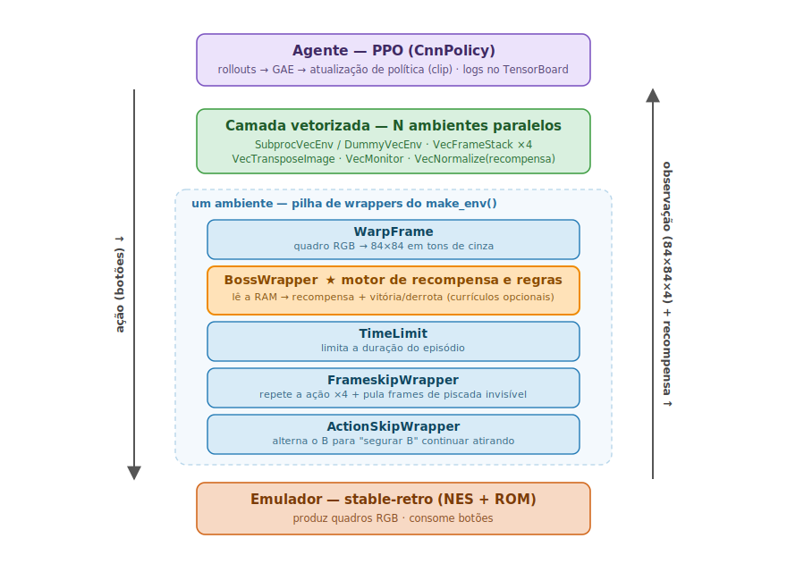

# Guia de Arquitetura

*Leia em outro idioma: [English](ARCHITECTURE.md) · **Português***

Este documento explica como o projeto é construído, o que cada classe faz e como as peças se
encaixam. Foi escrito para alguém que **nunca viu o código** e não se assume nenhum conhecimento
avançado de aprendizado por reforço (RL). Leia de cima para baixo e você conseguirá se virar no
código com confiança.

> Resumo — Uma rede neural aprende a jogar as lutas de chefe de *Mega Man* (NES) olhando para a tela
> (apenas os pixels) e apertando botões. O jogo roda dentro de um emulador; uma pilha de pequenas
> classes "wrapper" transforma os quadros crus na entrada da rede e transforma leituras da memória
> do jogo em uma recompensa numérica. O algoritmo PPO usa essa recompensa para melhorar a rede aos
> poucos.

---

## 1. Que problema estamos resolvendo?

Queremos um agente (uma rede de política) que **derrote um chefe** em *Mega Man 1* usando apenas o
que um humano veria — os pixels na tela. O agente não tem acesso privilegiado ao estado interno do
jogo na sua *observação*: ele precisa inferir tudo (posição do inimigo, sua própria vida, o timing
dos projéteis) a partir da imagem.

Isso é formulado como um problema de **aprendizado por reforço**:

- A cada passo o agente recebe uma **observação** (a tela).
- Ele escolhe uma **ação** (uma combinação de botões).
- O ambiente devolve uma **recompensa** (um número pequeno que diz quão bem o agente está indo) e a
  próxima observação.
- O objetivo do agente é maximizar a recompensa total ao longo de um episódio (uma luta de chefe).

Usamos **PPO** (Proximal Policy Optimization), um algoritmo de RL popular e estável, da biblioteca
[stable-baselines3](https://stable-baselines3.readthedocs.io/). O jogo de NES é emulado pelo
[stable-retro](https://github.com/Farama-Foundation/stable-retro).

### Mini-glossário (o suficiente para continuar)

| Termo | Significado neste projeto |
|-------|----------------------------|
| **Episódio** | Uma luta de chefe, do reset até o chefe morrer, o jogador morrer ou um limite de tempo. |
| **Política** | A rede neural que mapeia uma observação em uma ação. |
| **Observação** | Uma imagem 84×84 em tons de cinza, empilhada nos últimos 4 quadros (`84×84×4`). |
| **Ação** | Uma escolha `MultiDiscrete`: uma direção de movimento + pulo (A) + tiro (B). |
| **Recompensa** | `r = d·(acertos − m·dano)`; pequeno positivo por acertar o chefe, negativo por sofrer dano. |
| **Frameskip** | O agente age uma vez a cada N quadros do emulador (aqui N=4), num ritmo mais humano. |
| **Empilhamento de quadros** | Fornecer os últimos 4 quadros para a rede perceber movimento/velocidade. |
| **PPO** | O algoritmo de treino que atualiza a política a partir da experiência coletada. |
| **GAE** | Generalized Advantage Estimation — como o PPO estima "quão melhor que a média" uma ação foi. |
| **PBRS** | Potential-Based Reward Shaping — um sinal de recompensa extra e *seguro*, usado só no Yellow Devil. |
| **HP do chefe** | A vida do chefe, lida da RAM do emulador. Chegar a 0 = vitória. |

---

## 2. A visão geral

Os dados fluem em um laço fechado. O emulador produz um quadro; uma pilha de wrappers o transforma na
observação do agente e converte leituras da memória do jogo em uma recompensa; o agente (PPO) escolhe
uma ação; os wrappers a traduzem de volta em botões; o emulador avança um passo. Periodicamente, o
PPO pega os dados `(observação, ação, recompensa)` coletados e melhora a política.



**Como ler o diagrama:** a seta da direita é a **observação + recompensa** subindo de baixo para
cima; a seta da esquerda é a **ação** descendo de cima para baixo. Comece de baixo: o **emulador**
emite um quadro RGB cru, que sobe pela pilha de wrappers de um ambiente (`make_env`) — cada wrapper
adiciona uma transformação — depois pela **camada vetorizada** que roda N cópias em paralelo e
empilha os últimos 4 quadros, e por fim chega ao **agente PPO**. A ação escolhida desce pelo mesmo
caminho, onde o `ActionSkipWrapper` a converte na cadência de botões correta do NES pouco antes de
chegar ao emulador. A caixa laranja em destaque, `BossWrapper`, é onde a recompensa e as condições de
vitória/derrota são calculadas.

Dois scripts comandam tudo:

- **`src/train.py`** — monta o ambiente, cria o modelo PPO, roda o laço de treino e salva os
  checkpoints e o melhor modelo.
- **`src/eval_win.py`** — carrega um modelo salvo e mede se ele derrota o chefe.

Ambos dependem de **`src/env.py`** (para construir ambientes) e de **`src/wrappers.py`** (as classes
de transformação). O jogo em si vem de **`custom_integrations/`** mais um ROM fornecido pelo usuário.

---

## 3. Estrutura do repositório

```
src/
  wrappers.py   # as classes de transformação (o coração do ambiente)
  env.py        # funções fábrica que montam e vetorizam ambientes
  train.py      # ponto de entrada do treino (PPO + callbacks + a "receita" fixa)
  eval_win.py   # ponto de entrada da avaliação (carrega um modelo, conta vitórias)
  __init__.py   # torna `src` um pacote importável
custom_integrations/MegaMan-v1-Nes/   # a definição do jogo para o stable-retro (sem o ROM)
docs/ARCHITECTURE.pt-BR.md            # este arquivo
environment.yml / requirements.txt    # dependências
README.md / README.pt-BR.md           # guia de uso (inglês / português)
```

Gerados em tempo de execução (não versionados): `logs/`, `checkpoints/`, `models/`.

**Por onde começar a ler:** `src/wrappers.py` (entender o ambiente), depois `src/env.py` (como ele é
montado), depois `src/train.py` (como ele é treinado), depois `src/eval_win.py`.

---

## 4. O ambiente, wrapper por wrapper

Um "wrapper" é uma classe que envolve outro ambiente, interceptando `reset()` e `step()` para
adicionar comportamento. Eles formam uma cebola: cada um chama o que está dentro dele. A ordem
importa. Do mais interno (mais perto do emulador) ao mais externo (mais perto do agente), como
montado em `make_env`:

```
stable_retro.make(...)        # ambiente NES cru: imagem RGB entra, botões saem
  └─ ActionSkipWrapper        # corrige a cadência do botão de tiro
       └─ FrameskipWrapper     # age a cada 4 quadros; também pula os quadros de "piscada"
            └─ TimeLimit        # encerra o episódio após um número fixo de quadros
                 └─ BossWrapper  # calcula a recompensa e as condições de vitória/derrota
                      └─ WarpFrame  # converte a imagem para 84×84 em tons de cinza (mais externo)
```

### 4.1 `ActionSkipWrapper`

**Problema que resolve:** No NES, o Mega Man atira só quando você *aperta* o B — segurar o B não faz
nada depois do primeiro tiro. Uma política que aprendesse a "segurar o B" atiraria uma vez e pararia.

**O que faz:** Mantém um bit alternador (`b_state`). Quando o agente pede "atirar" (`action[0] == 1`),
ele deixa o aperto passar em um passo e força a soltura no próximo, de modo que uma política que
simplesmente segura o B ainda dispara uma rajada contínua. O botão de pulo (A) **não** é alternado,
pois picotar o pulo impediria o Mega Man de alcançar o olho do Yellow Devil.

> Layout de ação usado em todo o código: `action[0]` = B (tiro), `action[1]` = D-pad
> (nada/esquerda/direita/cima/baixo), `action[2]` = A (pulo). É um espaço `MultiDiscrete([2, 5, 2])`.

### 4.2 `FrameskipWrapper`

**Problema que resolve:** O NES roda a ~60 quadros/segundo. Decidir 60 vezes por segundo é
desperdício e dificulta a atribuição de crédito. Além disso, logo após sofrer dano o Mega Man
"pisca" (fica invisível), então esses quadros carregam pouca informação visual útil.

**O que faz:**
- Repete a ação escolhida por `skip` (=4) quadros do emulador, somando as recompensas.
- Depois continua avançando *enquanto o Mega Man está em um quadro de piscada invisível*, inferido
  do valor de RAM `blink_counter` (invisível quando `blink_counter % 4 ∈ {1, 2}`), até um teto de
  segurança de 60 quadros extras. Assim a próxima observação do agente é um quadro *visível*.
- `frame_sink`: um gancho opcional. Se for uma lista, cada quadro cru do emulador (RGB + áudio) é
  anexado a ela — usado por ferramentas externas de gravação para capturar o gameplay real. Não é
  usado no treino.

### 4.3 `TimeLimit` (do Gymnasium)

Um wrapper padrão que trunca o episódio após `max_episode_steps`. Nós o calculamos como
`max_episode_frames // frameskip`, de modo que mudar o frameskip mantém aproximadamente o mesmo
*tempo de jogo* por episódio (ex.: 7200 quadros = 1800 agent-steps com skip 4).

### 4.4 `BossWrapper` — o motor de recompensa e regras

Este é o wrapper mais importante. Ele lê a RAM do jogo a cada passo e a transforma na recompensa e
nas condições de fim de episódio. Ele nunca altera a *imagem* que o agente vê; só altera a
*recompensa* e os sinais de *done* (e expõe valores úteis no dicionário `info`).

**Função de recompensa** (calculada em `step`):

```
reward = 0
reward += d                       se o chefe perdeu HP neste passo        (um acerto entrou)
reward -= d * damage_penalty_mult se o jogador perdeu HP neste passo      (sofreu dano)
reward += win_bonus               no passo em que o chefe chega a 0 de HP  (terminal)
# termos opcionais/densos (desligados na receita padrão):
reward += aim_bonus  / -= waste_penalty   ao atirar com o olho aberto / fechado
reward += survival_bonus                  por passo vivo
reward += gamma*phi(s') - phi(s)          termo de mira PBRS (só Yellow Devil, veja abaixo)
```

com `d = 0.05`. Durante o **treino** `damage_penalty_mult = 2.0` e `win_bonus = 0.5`; durante a
**avaliação** eles voltam para `1.0` e `0.0` (a tarefa real). É por isso que uma avaliação *flawless*
(matar o chefe sem sofrer dano) pontua exatamente `n_hits · d`.

**Condições de terminação** (o episódio acaba quando):
- a vida do jogador chega a 0, ou o contador de vidas cai (morte);
- o Mega Man toca espinhos (`touching_obj_top == 3` ou `touching_obj_side == 3`);
- a vida do chefe chega a 0 (**vitória**);
- a munição acaba com o chefe ainda vivo (relevante só para armas com munição limitada).

**Valores de RAM que ele lê** (via as variáveis nomeadas da integração, com fallbacks seguros):
`health`, `lives`, `boss_health`, `weapon_energy`, `eye_state`, `x`, `y`, `screen`, além da
coordenada Y do olho do Yellow Devil (endereço de RAM `1537`), lida diretamente para o termo de mira.

**Potential-Based Reward Shaping (PBRS), `align_bonus`** — usado só no Yellow Devil. O chefe só fica
vulnerável por ~1 quadro quando o olho abre, e um tiro aleatório praticamente nunca acerta, então o
agente nunca recebe uma primeira recompensa para aprender (a "parede de bootstrap"). O PBRS adiciona
um gradiente denso de "leve seu tiro até a altura do olho":

```
phi(s)   = align_bonus · exp(-(err/18)²),  err = | altura do tiro − altura do olho | (em pixels)
shaping  = gamma · phi(s') − phi(s)
```

A propriedade-chave (Ng et al., 1999) é que essa forma de shaping é **invariante à política ótima**:
ela guia a exploração sem mudar qual política é ótima, então o agente não consegue "farmar" o sinal
flutuando perto do olho sem matar o chefe. `phi` é forçado a 0 quando o chefe morre (valor terminal
correto).

**Botões de currículo opcionais** (presentes na classe, todos *desligados* na receita padrão,
mantidos para experimentação): `unlimited_ammo`, `invincible`, `bonus_hp`, `survival_bonus`,
`waste_penalty`, `aim_bonus`, `ammo_budget`, `fire_from_action`, `post_kill_frames`. Foram usados no
desenvolvimento da receita (ex.: pré-treinar a mira com munição infinita) e estão documentados nos
comentários do código.

**Auxiliar:** `_info_dict(...)` monta o dicionário `info` de cada passo (`hp`, `boss_hp`, `lives`,
`x`, `y`, `screen`, `weapon_energy`, `eye_state`) em um só lugar, usado de forma idêntica por `reset`
e `step`.

> Detalhe sutil mas importante tratado no `reset`: o `info` do stable-retro costuma vir **vazio** logo
> após um reset. Confiar em um default errado (ex.: `lives = 9` quando o save tem 8) faria o primeiro
> passo parecer "perdeu uma vida" e encerrar o episódio com um passo só. Por isso o `reset` lê os
> valores **reais** direto da RAM via `lookup_value`.

### 4.5 `WarpFrame`

Converte cada quadro RGB para tons de cinza e redimensiona para 84×84 (`cv2.cvtColor` + `cv2.resize`
com `INTER_AREA`). É o pré-processamento padrão estilo Atari: cor é desnecessária e uma imagem menor
é muito mais barata para a CNN. Formato de saída: `(84, 84, 1)`. É o wrapper **mais externo**, então
sua saída é exatamente o que a camada vetorizada (próxima seção) empilha e entrega à política.

---

## 5. Montando e vetorizando ambientes — `src/env.py`

`env.py` contém as funções fábrica que constroem a pilha de wrappers acima e então rodam muitas
cópias dela em paralelo.

- **`_register_custom_integrations()`** — diz ao stable-retro onde encontrar nosso jogo customizado
  (`custom_integrations/`). Roda uma vez por processo (uma flag de guarda evita registrar de novo).
  Isso importa porque os workers paralelos são processos separados que reimportam o módulo.

- **`make_env(...)`** — constrói **um** ambiente: chama `stable_retro.make(...)` com
  `inttype=CUSTOM_ONLY` (usar só nossa integração), ações `MULTI_DISCRETE` e observações `IMAGE`,
  e então o envolve na cebola da Seção 4. Retorna um único ambiente Gym. Todos os parâmetros de
  recompensa/currículo são repassados direto ao `BossWrapper`.

- **`make_venv(...)`** — constrói **N** ambientes e coloca a camada vetorizada por cima:
  1. `SubprocVecEnv` (processos paralelos) se `n_envs > 1`, senão `DummyVecEnv` (no mesmo processo).
  2. `VecFrameStack(n_stack=4)` — empilha os últimos 4 quadros em cinza → a entrada real do agente
     vira `84×84×4`. É isso que permite a uma CNN sem recorrência perceber movimento.
  3. `VecTransposeImage` — reordena os eixos para o formato do PyTorch `(canais, altura, largura)`.
  4. `VecMonitor(info_keywords=("hp", "boss_hp"))` — registra estatísticas dos episódios.
  5. `VecNormalize(norm_obs=False, norm_reward=True)` — normalização opcional (running) só da
     **recompensa** (nunca da imagem), que afia o sinal de aprendizado e é segura para avaliação.

  Para evitar duplicar a longa lista de parâmetros, os ajustes por ambiente são reunidos uma vez em um
  dict `env_kwargs` e repassados a cada worker; só `render_mode`/`record` variam por rank do worker.

O resultado de `make_venv` é o único objeto com o qual o PPO interage: chamar `.step(actions)` nele
avança todos os N ambientes de uma vez e retorna observações, recompensas e flags de `done` em lote.

---

## 6. Treino — `src/train.py`

### 6.1 A "receita" (constantes de módulo)

Como os hiperparâmetros e a recompensa são **os mesmos para todos os chefes**, eles ficam fixados como
constantes no topo do arquivo, em vez de flags de linha de comando. É isso que torna a receita
reprodutível: não há nada para digitar errado.

- Recompensa/currículo: `D = 0.05`, `DAMAGE_PENALTY_MULT = 2.0`, `WIN_BONUS = 0.5`, `FRAMESKIP = 4`,
  `NORM_REWARD = True`.
- PPO: `LR = 2.5e-4` (decaimento linear), `ENT_COEF = 5e-3`, `TARGET_KL = 0.05`, `GAMMA = 0.99`,
  `GAE_LAMBDA = 0.95`, `CLIP_RANGE = 0.2`, `VF_COEF = 1.0`, `MAX_GRAD_NORM = 0.5`, `N_STEPS = 1024`,
  `BATCH_SIZE = 128`, `N_EPOCHS = 4`, `SEED = 666`.

Só as poucas coisas que realmente mudam por chefe são flags: `--tag`, `--state`, `--n-hits` e (para o
Yellow Devil) `--align-bonus` e `--episode-frames`.

### 6.2 `linear_schedule(initial_value)`

Retorna uma função que o PPO chama com `progress_remaining` indo de 1.0 (início) a 0.0 (fim),
produzindo um learning rate que decai linearmente até 0. Um LR decrescente ajuda a política a afinar
depois de já ter se estabilizado.

### 6.3 Callback de avaliação (`EvalCallback`)

A cada `eval_freq` passos o `EvalCallback` de fábrica do SB3 roda a política atual em um **ambiente de
avaliação separado** (a tarefa *real* — sem reward shaping, `damage_penalty_mult = 1.0`, sem win
bonus) e:
- registra `eval/mean_reward` e `eval/mean_ep_length` no TensorBoard;
- salva `best_model.zip` sempre que a recompensa média melhora;
- repassa o controle a um callback `StopTrainingOnRewardThreshold` (veja o early-stop abaixo).

O callback de fábrica já faz tudo isso, então nenhuma subclasse é necessária.

### 6.4 `main()` — o procedimento de treino

1. Faz o parse das poucas flags por chefe.
2. Calcula o **limiar de early-stop**: `reward_threshold = (n_hits − 0.5)·d`. Uma morte flawless
   pontua `n_hits·d`; o limiar fica logo abaixo, então o treino só para quando o agente vence *sem
   sofrer dano*.
3. Constrói dois ambientes com `make_venv`:
   - **ambiente de treino** — com shaping (penalidade de dano 2×, win bonus e o bônus de mira do YD);
   - **ambiente de avaliação** — a tarefa real (sem shaping), um único ambiente, usado pelo callback.
4. Cria os callbacks:
   - `CheckpointCallback` — salva um checkpoint a cada ~500k passos;
   - `StopTrainingOnRewardThreshold` — o gatilho de early-stop;
   - `EvalCallback` — roda a avaliação a cada ~100k passos, salva o melhor modelo.
5. Cria o modelo PPO com `CnnPolicy` e as constantes da receita, ou retoma de um checkpoint se
   `--checkpoint` for dado.
6. Chama `model.learn(...)`. O PPO repetidamente: coleta um rollout de experiência dos N ambientes
   paralelos, calcula as vantagens com **GAE** e atualiza a rede com o objetivo recortado do PPO.
7. Quando o treino acaba (early-stop ou o teto de timesteps), salva `final_model.zip` além do
   `best_model.zip` produzido pelo callback de avaliação.

**Saídas** (namespaceadas por `--tag`): `logs/<tag>/` (TensorBoard), `checkpoints/<tag>/` (snapshots
periódicos), `models/<tag>_best/best_model.zip` e `.../final_model.zip`.

---

## 7. Avaliação — `src/eval_win.py`

Este script responde a uma pergunta simples: *esse modelo salvo realmente derrota o chefe?*

- **`run_episode(model, env, deterministic)`** — joga um episódio inteiro e retorna um dict com a
  recompensa total, o número de passos, o **menor HP do chefe observado** (`min_boss`; 0 significa que
  o chefe morreu), o HP final do jogador e uma flag `win` (`min_boss <= 0`). Um teto de segurança de
  5000 passos evita travamentos.
- **`main()`** — carrega o modelo PPO, constrói um único ambiente da **tarefa real** (sem shaping, com
  `D`/`FRAMESKIP` iguais aos do treino), roda `--episodes` episódios (estocástico por padrão, ou
  `--deterministic` para a política gulosa) e imprime os resultados por episódio mais um resumo:
  **taxa de vitória, recompensa média ± desvio e duração média**.

Como a avaliação usa a tarefa sem shaping, a recompensa reportada é diretamente comparável ao teto
flawless `n_hits·d`.

---

## 8. A definição do jogo — `custom_integrations/MegaMan-v1-Nes/`

O stable-retro não conhece *Mega Man* por padrão; nós fornecemos uma **integração customizada**: uma
pasta que descreve como ler e controlar o jogo. Ela contém:

- **`rom.nes`** — o jogo de fato (um ROM de NES). **Não incluído** por questões legais; você fornece o
  seu. O stable-retro o verifica contra...
- **`rom.sha`** — o SHA-1 esperado do ROM (`2f88381…`).
- **`data.json`** — declara as **variáveis de RAM** que o projeto lê (seus endereços de memória e
  tipos): ex.: `health`, `lives`, `boss_health`, `weapon_energy`, `eye_state`, `x`, `y`, `screen`,
  `blink_counter`, `touching_obj_*`. Esses nomes são exatamente o que o `BossWrapper` consulta.
- **`scenario.json`** — declara o conjunto de ações (os grupos de botões que formam o espaço
  `MultiDiscrete`). A lógica de recompensa/done de fato vive no `BossWrapper`, não aqui.
- **`metadata.json`** — metadados da integração (ex.: o estado inicial padrão).
- **`*.state`** — **save states**: snapshots do emulador que jogam o agente direto em uma luta de
  chefe específica (`Bombman-boss.state`, `YellowDevil-boss.state`, …). São os pontos de partida por
  chefe selecionados com `--state`.

Quando `make_env` chama `stable_retro.make(..., inttype=CUSTOM_ONLY, state=<nome>)`, o stable-retro
carrega o ROM, aplica o save state nomeado e expõe as variáveis de RAM do `data.json` no dicionário
`info` a cada passo.

---

## 9. Ciclo de vida ponta a ponta

```
   você fornece o rom.nes
          │
          ▼
  python src/train.py --tag bombman --state Bombman-boss --n-hits 14
          │   monta o ambiente de treino (com shaping) + o de avaliação (real)
          │   o PPO coleta rollouts → GAE → atualização da política  (repete)
          │   avalia a cada ~100k passos → salva o best_model quando melhora
          │   early-stop quando a recompensa de eval ≥ (n_hits-0.5)·d  (vitória flawless)
          ▼
  models/bombman_best/best_model.zip
          │
          ▼
  python src/eval_win.py --model models/bombman_best/best_model.zip --state Bombman-boss
          │   roda N episódios na tarefa real
          ▼
  "Wins: 10/10 (100%)  Mean reward: 0.7000  Mean length: 146 agent-steps"
```

Por chefe, as únicas diferenças são o `--state`, o `--n-hits` (que define o limiar de early-stop) e —
só no Yellow Devil — o `--align-bonus 0.10` e um `--episode-frames 14400` maior. Todo o resto é a
receita compartilhada.

---

## 10. Decisões de projeto que vale conhecer

- **Só pixels.** Todo o conhecimento do estado do jogo (HP, HP do chefe, estado do olho, posições) é
  usado *apenas* para construir a recompensa e o sinal de done — nunca adicionado à observação. A
  política precisa aprender a ler a tela.
- **Sem LSTM, sem currículo.** O empilhamento de quadros (4 quadros) dá à CNN sem recorrência contexto
  temporal suficiente; uma política recorrente e os vários currículos se mostraram desnecessários. O
  que importou foi uma recompensa bem modelada (PBRS no Yellow Devil) e episódios longos o bastante.
- **Uma receita genérica.** Os mesmos hiperparâmetros e recompensa derrotam os sete chefes; o endereço
  do HP do chefe (1729) é genérico, então adaptar para um chefe novo é basicamente escolher
  `n_hits = ceil(28 / dano_por_tiro)`.
- **Reprodutibilidade.** Uma seed fixa (666), constantes em vez de flags para a receita e um ambiente
  fixado (`environment.yml` / `requirements.txt`) tornam as execuções repetíveis a menos da
  estocasticidade do emulador/política.

---

## 11. Glossário de arquivos e classes (referência rápida)

| Símbolo | Arquivo | Papel |
|---------|---------|-------|
| `ActionSkipWrapper` | `wrappers.py` | Alterna o botão B para que "segurar B" continue atirando. |
| `FrameskipWrapper` | `wrappers.py` | Age a cada 4 quadros; pula os quadros de piscada invisível. |
| `BossWrapper` | `wrappers.py` | Lê a RAM → calcula recompensa e vitória/derrota; currículos opcionais. |
| `WarpFrame` | `wrappers.py` | Quadro RGB → 84×84 em tons de cinza (wrapper mais externo). |
| `_register_custom_integrations` | `env.py` | Registra o jogo customizado no stable-retro (uma vez por processo). |
| `make_env` | `env.py` | Constrói um ambiente envolvido pelos wrappers. |
| `make_venv` | `env.py` | Constrói N ambientes paralelos + frame stacking, transpose, monitor, normalize. |
| `linear_schedule` | `train.py` | Função de decaimento do learning rate. |
| `main` (train) | `train.py` | Monta tudo; usa o `EvalCallback` do SB3 e roda o laço de treino do PPO. |
| `run_episode` | `eval_win.py` | Joga um episódio; reporta vitória + métricas. |
| `main` (eval) | `eval_win.py` | Carrega um modelo e reporta a taxa de vitória em N episódios. |
